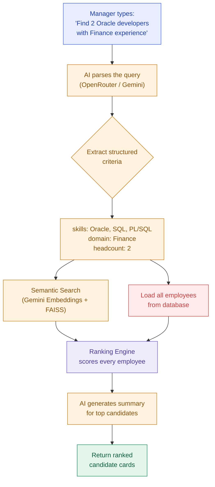
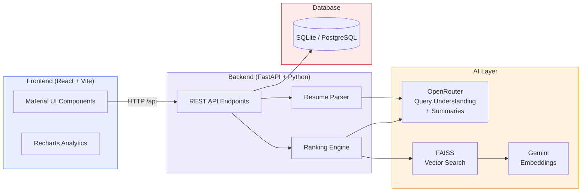
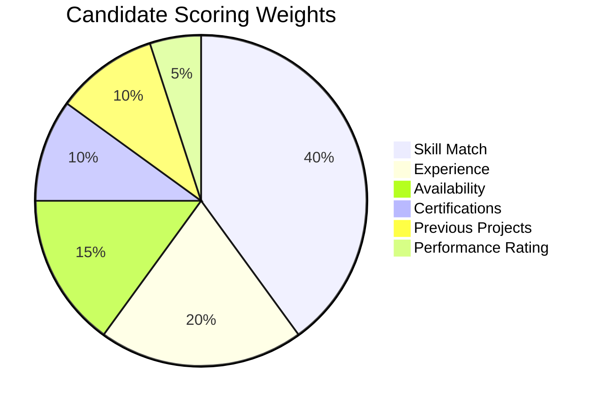
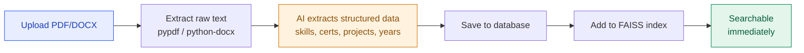
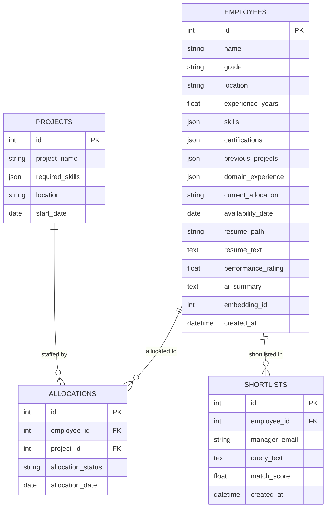

<div align="center">

# GenAI Resource Allocation Assistant

**An AI-powered chatbot that helps project managers find the best available employees using natural language — instantly.**

[](https://www.python.org/)
[](https://fastapi.tiangolo.com/)
[](https://react.dev/)
[](https://mui.com/)
[](LICENSE)

[Quick Start](#-quick-start) · [Features](#-features) · [How It Works](#-how-it-works) · [Tech Stack](#-tech-stack) · [API Reference](#-api-reference) · [Deploy](#-deploy-to-production)

</div>

---

## The Problem

In most organizations, staffing a new project follows a painful cycle:

```
Manager raises request → Resource manager searches spreadsheets manually
→ Multiple emails and Teams messages → Profiles reviewed one by one
→ Candidates shortlisted → Days to weeks later, project can begin
```

**Common pain points:** slow turnaround, skill mismatches, bench resources overlooked, and delayed project onboarding.

## The Solution

This app replaces the entire manual process with **one chatbot query**:

> *"Find two Oracle EBS developers with SQL, Finance domain experience, and immediate availability."*

The system instantly returns:

- **Best matching employees** — ranked by a weighted scoring algorithm
- **Match percentage** — based on skills, experience, availability, certifications, projects, and rating
- **AI-generated summary** — a professional 2-3 sentence recommendation for each candidate
- **Explanation** — clear reasons why each person was recommended

---

## Features

All 13 requirements from the Software Requirements Document are implemented and working:

| # | Feature | Description |
|---|---------|-------------|
| 1 | **Login** | Dummy auth for PoC — any email/password works. Email determines role. |
| 2 | **Chatbot Interface** | Natural language search — type what you need in plain English |
| 3 | **Employee Database** | 15 pre-seeded employee profiles with full details |
| 4 | **Resume Upload** | PDF and DOCX support with automatic AI extraction |
| 5 | **AI Skill Matching** | Understands related skills (Oracle APEX → PL/SQL, Oracle SQL) |
| 6 | **Semantic Search** | Gemini embeddings + FAISS for meaning-based matching |
| 7 | **Candidate Ranking** | Weighted scoring: Skills 40%, Experience 20%, Availability 15%, Certs 10%, Projects 10%, Rating 5% |
| 8 | **AI Summary** | Auto-generated professional candidate summaries |
| 9 | **Recommendation Explanation** | Clear reasons for each recommendation |
| 10 | **Candidate Cards** | Name, experience, skills, match %, availability at a glance |
| 11 | **Employee Profile** | Full profile view with resume, projects, certifications, skill graph |
| 12 | **Shortlist** | Save candidates for later review |
| 13 | **Analytics Dashboard** | Bench count, allocation stats, skill distribution, most requested skills |

### User Roles

| Role | Email pattern | Access |
|------|--------------|--------|
| **Project Manager** | Any email (e.g. `pm@company.com`) | Search, view profiles, shortlist, analytics |
| **Resource Manager** | Email containing "rm" (e.g. `rm@company.com`) | Everything above + resume upload |

---

## How It Works

### Search Flow



### Architecture



### Scoring Algorithm

Each candidate receives a weighted match score:



**Skill match** uses both exact keyword overlap and semantic similarity from FAISS — so related-but-not-identical skills (e.g., searching "Oracle APEX" matches "PL/SQL") contribute to the score.

### Resume Upload Flow



---

## Quick Start

### Prerequisites

| Tool | Version | Download |
|------|---------|----------|
| Python | 3.10+ | [python.org/downloads](https://www.python.org/downloads/) |
| Node.js | 18+ | [nodejs.org](https://nodejs.org/) |

That's all. No Docker, no database server, no cloud accounts required.

### Clone and run

```bash
git clone https://github.com/Sivakumarraj/cap.git
cd cap
```

**Windows (PowerShell):**
```powershell
.\setup.ps1    # creates venv, installs deps, seeds 15 employees (~2 min)
.\run.ps1      # starts backend + frontend
```

**macOS / Linux:**
```bash
chmod +x setup.sh run.sh
./setup.sh     # creates venv, installs deps, seeds 15 employees (~2 min)
./run.sh       # starts backend + frontend
```

Then open **http://localhost:5173** and sign in:

| Email | Role |
|-------|------|
| `pm@company.com` | Project Manager |
| `rm@company.com` | Resource Manager (can upload resumes) |

> Any email and password works. The email just determines your role.

### Add AI keys (optional)

The app runs **without** any API keys — search falls back to keyword matching and summaries are built from employee data. To enable AI features, edit `backend/.env`:

| Key | What it enables | Get it free at |
|-----|----------------|----------------|
| `OPENROUTER_API_KEY` | Query understanding + AI summaries | [openrouter.ai/keys](https://openrouter.ai/keys) |
| `GEMINI_API_KEY` | Semantic search (embeddings) | [aistudio.google.com/apikey](https://aistudio.google.com/apikey) |

Both keys are **free**. Nothing errors out without them — the app gracefully degrades to keyword-based matching.

---

## Tech Stack

| Layer | Technology | Purpose |
|-------|-----------|---------|
| **Frontend** | React 18 + Vite | Single-page app with fast hot reload |
| **UI Library** | Material UI 6 | Professional pre-built components |
| **Charts** | Recharts | Bar charts, pie charts on analytics page |
| **Backend** | FastAPI + Python | Modern async REST API |
| **ORM** | SQLAlchemy 2 | Database-agnostic queries (SQLite + PostgreSQL) |
| **Database** | SQLite (local) / PostgreSQL (prod) | Employee data, projects, shortlists |
| **Chat AI** | OpenRouter (Gemma, GPT-OSS) | Query parsing, summaries, resume extraction |
| **Embeddings** | Gemini `gemini-embedding-001` | Convert text to meaning vectors |
| **Vector Search** | FAISS (by Meta) | Millisecond similarity search over embeddings |
| **Auth** | JWT (python-jose) | Dummy token-based auth for PoC |
| **Resume Parsing** | pypdf + python-docx | Extract text from PDF and DOCX files |

> **Why two AI providers?** OpenRouter has a generous free chat tier but no embeddings endpoint. Gemini's free chat quota is only 20 req/day, but its embedding quota is large and separate. Splitting across both gives the best free-tier experience.

---

## Project Structure

```
genai-resource-allocation/
├── backend/
│   ├── app/
│   │   ├── api/                    # REST endpoints
│   │   │   ├── auth.py             # POST /login — dummy JWT auth
│   │   │   ├── search.py           # POST /searchCandidates — main search
│   │   │   ├── employees.py        # GET /employees, /employee/{id}
│   │   │   ├── resumes.py          # POST /uploadResume
│   │   │   ├── shortlist.py        # POST + GET /shortlist
│   │   │   └── analytics.py        # GET /analytics
│   │   ├── chatbot/                # AI logic
│   │   │   ├── gemini_client.py    # OpenRouter + Gemini API calls
│   │   │   ├── ranking.py          # Weighted scoring algorithm
│   │   │   └── resume_parser.py    # PDF/DOCX text extraction
│   │   ├── core/
│   │   │   ├── config.py           # Environment settings (Pydantic)
│   │   │   └── db.py               # SQLAlchemy engine + session
│   │   ├── embeddings/
│   │   │   └── faiss_index.py      # FAISS index build/search/persist
│   │   ├── models/
│   │   │   └── models.py           # Employee, Project, Allocation, Shortlist
│   │   ├── schemas/
│   │   │   └── schemas.py          # Pydantic request/response models
│   │   ├── main.py                 # FastAPI app entry point
│   │   └── seed.py                 # Seed 15 sample employees + 3 projects
│   ├── .env.example                # Template for API keys
│   ├── requirements.txt            # Python dependencies
│   └── render.yaml                 # Render deployment blueprint
├── frontend/
│   ├── src/
│   │   ├── pages/
│   │   │   ├── LoginPage.jsx       # Login form
│   │   │   ├── ChatbotPage.jsx     # Main search interface
│   │   │   ├── EmployeeProfilePage.jsx
│   │   │   ├── ShortlistPage.jsx
│   │   │   ├── AnalyticsPage.jsx
│   │   │   └── UploadResumePage.jsx
│   │   ├── components/
│   │   │   ├── CandidateCard.jsx   # Search result card
│   │   │   └── Layout.jsx          # App shell with nav tabs
│   │   ├── context/
│   │   │   └── AuthContext.jsx     # Auth state management
│   │   ├── api/
│   │   │   └── client.js           # Axios instance with JWT interceptor
│   │   ├── App.jsx                 # Routes
│   │   └── main.jsx                # React entry point
│   ├── package.json
│   ├── vite.config.js              # Dev proxy /api → localhost:8000
│   └── vercel.json                 # Vercel SPA routing
├── resumes/                        # Uploaded resumes stored here
├── setup.ps1                       # Windows one-command setup
├── setup.sh                        # macOS/Linux one-command setup
├── run.ps1                         # Windows start both servers
└── run.sh                          # macOS/Linux start both servers
```

---

## API Reference

All endpoints are available at `http://localhost:8000` when running locally. Interactive Swagger docs at [`/docs`](http://localhost:8000/docs).

| Method | Endpoint | Description | Auth |
|--------|----------|-------------|------|
| `POST` | `/login` | Sign in (any email/password) | No |
| `POST` | `/searchCandidates` | Natural language employee search | Bearer |
| `GET` | `/employees` | List all employees | Bearer |
| `GET` | `/employee/{id}` | Get single employee profile | Bearer |
| `POST` | `/uploadResume` | Upload PDF/DOCX, extract + create employee | Bearer |
| `POST` | `/shortlist` | Add candidate to shortlist | Bearer |
| `GET` | `/shortlist` | View shortlisted candidates | Bearer |
| `GET` | `/analytics` | Dashboard stats (bench, allocated, skills) | Bearer |
| `GET` | `/health` | Health check | No |

### Example: Search

```bash
curl -X POST http://localhost:8000/searchCandidates \
  -H "Content-Type: application/json" \
  -H "Authorization: Bearer <token>" \
  -d '{"query": "Find two Oracle developers with Finance experience", "top_k": 5}'
```

**Response:**
```json
{
  "query": "Find two Oracle developers with Finance experience",
  "candidates": [
    {
      "employee": {
        "id": 1,
        "name": "Rahul Sharma",
        "grade": "Senior Consultant",
        "location": "Bangalore",
        "experience_years": 5,
        "skills": ["Oracle EBS", "Oracle SQL", "PL/SQL", "Oracle Forms", "Finance Modules"],
        "certifications": ["Oracle Certified Professional"],
        "availability_date": "2026-07-28",
        "performance_rating": 4.8
      },
      "match_percent": 97.2,
      "score_breakdown": {
        "skill_match": 95.0,
        "experience": 100.0,
        "availability": 100.0,
        "certifications": 100.0,
        "projects": 85.0,
        "rating": 96.0
      },
      "reasons": [
        "95% skill match",
        "Finance domain experience",
        "Certified: Oracle Certified Professional",
        "Available immediately"
      ],
      "ai_summary": "Rahul has 5 years of Oracle EBS experience..."
    }
  ]
}
```

---

## Database Schema



---

## Deploy to Production

### Backend on Render

1. Push this repo to GitHub.
2. In Render: **New → Blueprint**, point it at the repo — it picks up `backend/render.yaml`, which provisions a free Postgres database and a web service.
   - Or manually: root directory `backend`, build command `pip install -r requirements.txt`, start command `uvicorn app.main:app --host 0.0.0.0 --port $PORT`.
3. Set environment variables on the web service:

   | Variable | Value |
   |----------|-------|
   | `DATABASE_URL` | From Render Postgres (change prefix to `postgresql+psycopg2://`) |
   | `GEMINI_API_KEY` | Your Gemini API key |
   | `OPENROUTER_API_KEY` | Your OpenRouter API key |
   | `JWT_SECRET` | Any random string |
   | `CORS_ORIGINS` | Your Vercel frontend URL |

4. Deploy, then run `python -m app.seed` once via Render's Shell tab.

> **Note:** Render's free tier has an ephemeral filesystem — the FAISS index file gets rebuilt automatically on the first search after a redeploy.

### Frontend on Vercel

1. In Vercel: **New Project → import repo**, set root directory to `frontend`.
2. It auto-detects Vite — `vercel.json` handles SPA routing.
3. Set environment variable `VITE_API_URL` to your Render backend URL (e.g. `https://genai-resource-allocation-api.onrender.com`).
4. Deploy. Copy the Vercel URL back to Render's `CORS_ORIGINS` env var.

---

## Run Locally (Manual Setup)

If you prefer to set things up step by step instead of using the setup scripts:

### Backend

```bash
cd backend
python -m venv venv

# Activate the virtual environment
# Windows:
venv\Scripts\activate
# macOS/Linux:
source venv/bin/activate

pip install -r requirements.txt
copy .env.example .env          # then add your API keys
python -m app.seed              # seed 15 employees (~1 min with embeddings)
uvicorn app.main:app --reload --port 8000
```

### Frontend

```bash
cd frontend
npm install
npm run dev
```

Visit **http://localhost:5173**. The Vite dev server proxies `/api` to `http://localhost:8000` automatically.

---

## Sample Employees

The seed script creates 15 realistic employee profiles spanning:

| Skill Area | Employees | Locations |
|-----------|-----------|-----------|
| Oracle EBS / SQL / APEX | 5 | Bangalore, Hyderabad, Kolkata, Gurugram |
| Java / Spring Boot / AWS | 5 | Bangalore, Hyderabad, Chennai, Pune |
| React / Node.js / Frontend | 2 | Bangalore |
| Python / ML / Data | 1 | Chennai |
| DevOps / Kubernetes / Terraform | 1 | Bangalore |
| Data Warehousing / ETL | 1 | Hyderabad |

Plus 3 sample projects and 5 allocations so analytics dashboards have data out of the box.

---

## Graceful Degradation

The app is designed to work at every level of API access:

| Scenario | Search | Summaries | Resume Extraction |
|----------|--------|-----------|-------------------|
| Both API keys set | Semantic (FAISS) + keyword | AI-generated | AI-powered |
| Only `GEMINI_API_KEY` | Semantic (FAISS) + keyword | Built from employee data | Keyword scan |
| Only `OPENROUTER_API_KEY` | Keyword matching only | AI-generated | AI-powered |
| No API keys | Keyword matching only | Built from employee data | Keyword scan |

Nothing errors out. The app gets less "smart" without keys but remains fully functional.

---

## Future Scope

- Microsoft Teams integration
- HRMS / HR system integration
- Email notifications for shortlisted candidates
- Interview scheduling
- Project demand prediction
- Learning recommendation engine
- Voice chat interface

---

<div align="center">

**Built with FastAPI + React + Gemini AI**

Made by [Sivakumar](https://github.com/Sivakumarraj)

</div>
